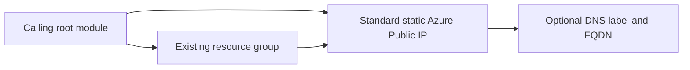

# Terraform Module for Azure Public IP

Provisions a [Standard static Azure Public IP address](https://registry.terraform.io/providers/hashicorp/azurerm/latest/docs/resources/public_ip).
The caller owns the resource group, provider configuration, backend, and
Terraform state.

## Dependency Graph



## Usage

```hcl
module "pip" {
  source              = "git::https://github.com/f2calv/tf_module_azurerm_public_ip.git//src?ref=0.3.0"
  resource_group_name = azurerm_resource_group.rg.name
  location            = azurerm_resource_group.rg.location
  public_ip_name      = "my-public-ip"
  domain_name_label   = "myapp"
  tags                = { environment = "dev" }
}
```

The resource group in this example is created by the calling root module and is
not managed by this module.

<!-- markdownlint-disable MD060 -->
<!-- BEGIN_TF_DOCS -->
## Requirements

| Name | Version |
| ---- | ------- |
| terraform | >= 1.0 |
| azurerm | >= 5.0, < 6.0 |

## Providers

| Name | Version |
| ---- | ------- |
| azurerm | >= 5.0, < 6.0 |

## Resources

| Name | Type |
| ---- | ---- |
| [azurerm_public_ip.this](https://registry.terraform.io/providers/hashicorp/azurerm/latest/docs/resources/public_ip) | resource |

## Inputs

| Name | Description | Type | Default | Required |
| ---- | ----------- | ---- | ------- | :------: |
| public\_ip\_name | Name of the public IP address. | `string` | n/a | yes |
| resource\_group\_name | Name of the parent resource group. | `string` | n/a | yes |
| domain\_name\_label | Label for the Domain Name. Will be used to make up the FQDN. | `string` | `null` | no |
| location | Location of the parent resource group. | `string` | `"West Europe"` | no |
| tags | Any tags that should be present on the resources. | `map(string)` | `{}` | no |

## Outputs

| Name | Description |
| ---- | ----------- |
| fqdn | The fully qualified domain name of the public IP. |
| id | The ID of the public IP address. |
| ip\_address | The assigned IP address. |
| location | The location of the public IP address. |
| name | The name of the public IP address. |
<!-- END_TF_DOCS -->
<!-- markdownlint-enable MD060 -->

## Development

Regenerate the Terraform reference after changing resources, variables,
outputs, or version constraints:

```bash
terraform-docs --config .terraform-docs.yml src
```

The pre-commit configuration runs the same command in CI and fails when
generated documentation is not committed.
